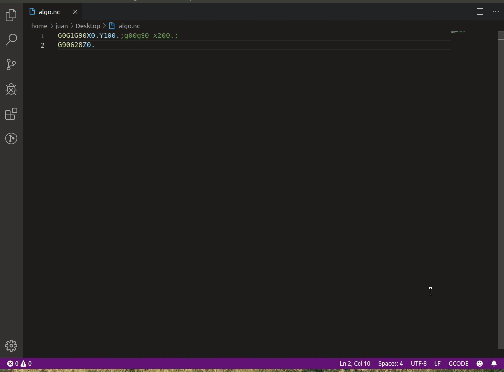

# GCode-Formatter README

This is a formatter for G-Code language.

## Features

The G-code formatter separates the G, M, S, X, Y and Z commands, transforms the text to uppercase, separates the lines by semicolons, removes semicolons at the end of each line and finally (but not least) format each operation with at least two digits (For example G1 -> G01).

## Releases

### 0.0.1

Initial release of Gcode formatter

### 0.0.2

Add centroid-gcode language support 

### 0.0.3

minor Bugfixes

### 0.0.4

Fix configuration problems

### 0.0.5

Tabulate R,C,I,J,C and F

### 0.0.6

Add test cases, travis and remove useless spaces in each line